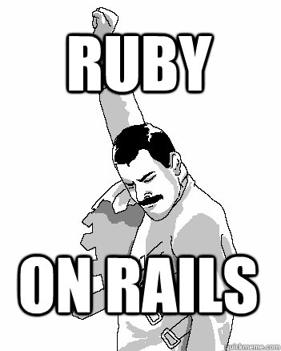

# Ruby on Rails!

### Learning Objectives

- Revisit the MVC pattern
- Dive into the "convention vs configuration" distinction a little more deeply
- Explore the file structure of a Rails app
- Build a Rails app about dinosaurs!

# What is Ruby on Rails?

Rails is an **MVC framework** for Ruby.

# Convention over configuration

Many other frameworks, like Express, give you a lot of flexibility. You can put folders wherever you want, create your own naming conventions, come up with your own best practices, etc. Rails is different.

In Rails, we adopt a philosophy of *convention over configuration*. This means that there is a standard *rails way* of doing things - how your file structrue should be organized, how things should be named, etc. This has many added benefits:

1. Once you learn the Rails way, you no longer have to think about how to organize your application code. This frees up all of your decision making time and energy to work on actual feature development.
2. Rails has been around for a **long** time. The "Rails way" is the result of over a decade of careful consideration and refactoring by thousands of people. The result is an extremely cohesive framework which prioritizes efficiency and developer happiness. Once you get the hang of it, you'll begin to appreciate how elegent Rails actually is.

### The Rails way is the right way!

Don't try to go against the grain in Rails. Follow the conventions, and things will just work. Go against them, and you will hate your life.

## Your new Bible

One of the amazing things about Rails (of which there are many) is that the community is **SUPERB** when it comes to documentation.

The [Ruby on Rails Guides](http://guides.rubyonrails.org/) is the defacto resource for all those getting into Rails, as well as seasoned pros. It is extensive, comprehensive, and easy to read. I highly recommend you read it all the way through, and continue to consult with it as you progress along your Rails journey.

The [Getting Started Guide](http://guides.rubyonrails.org/getting_started.html) can't be beat. If you do the whole thing and take your time, Rails should start to become very intuitive for you.

# j notes

- what is rails?
    - talk about mvc framework again -- compare to express
    - whiteboard the MVC pattern on the board again
    - talk about how it's comparable to -- the same basic parts
    - ruby, as we discussed, is a fully server-side language -- you'd never do any kind of front end manipulation in ruby
- convention vs configuration
    - express is largely about **configuration** -- you have to write your own `app.js`, you can set up your routes any way you want, etc.
    - rails is much more based on **convention**
